# 🚀 Awesome AI Interview Platform Ecosystem

## 📌 Top AI Interview Platform Ecosystem & Hiring Tools

**A Curated List of SaaS Products & Open-Source GitHub Projects**  
*Focused on AI-Powered Hiring Interviews, Voice Screening, Technical Coding Assessments, Proctoring & Candidate Evaluation*  
📅 **Last updated: September 2026**

---

## 💡 Overview & SEO Keywords

This repository tracks notable **SaaS platforms** and **open-source repositories** in the **AI Interview Platform** domain. These solutions conduct or assist video/voice interviews, generate automated candidate scorecards, conduct technical coding assessments, and help recruiters screen candidates at scale with structured, consistent evaluation.

**Key Topics**: `ai-interview`, `voice-screening`, `recruiting-automation`, `coding-assessments`, `hrtech`, `ai-hiring-copilot`, `mock-interviews`

---

## 📑 Table of Contents

- [🏢 SaaS / Hosted Platforms](#-saas--hosted-platforms)
- [💻 Open-Source GitHub Repositories](#-open-source-github-repositories)
- [🛠️ Architecture & DIY Frameworks](#%EF%B8%8F-architecture--diy-frameworks)
- [🤝 How to Contribute](#-how-to-contribute)
- [💖 Support & Sponsorship](#-support--sponsorship)
- [⚠️ Disclaimer](#%EF%B8%8F-disclaimer)
- [📈 Star History](#-star-history)

---

## 🏢 SaaS / Hosted Platforms

> [!NOTE]  
> **Market Size & Structure**: The global AI recruitment & automated interview market size is estimated at **$750M - $1.2B (2026)** with a CAGR of ~22%. The sector is currently **moderately fragmented**: enterprise incumbents (HireVue, CodeSignal) dominate enterprise HR accounts, while hyper-growth startups (Alex AI / Apriora, Metaview, Final Round AI) rapidly capture mid-market, tech hiring, and candidate co-pilot segments.

### 📊 SaaS Platform Comparison Table

| Company & Platform 🏢 | Company Size (Valuation / Revenue) 📈 | Specific Pricing 💵 | Free Tier / Trial Limit 🆓 | Key Features & Focus 🌟 |
| :--- | :--- | :--- | :--- | :--- |
| **[HireVue](https://www.hirevue.com/)** 💼 | **$400M Valuation** / ~$100M ARR | Entry plans start at **$35,000 / year** (Enterprise quote) | **No Free Trial** (Sales demo process only) | Enterprise structured AI video interviews, gamified skills assessments, & automated candidate evaluation. |
| **[CodeSignal](https://www.codesignal.com/)** ⚡ | **$488M Valuation** / ~$50M ARR | Individual Learn plan at **$24.99 / month**; Enterprise median contract ~$24,394 / year | **Free Forever Plan** available for CodeSignal Learn (Basic coding practice) | Advanced developer skills assessments, real-time IDE interviews, and Cosmos AI interviewer co-pilot. |
| **[Apriora (Alex AI)](https://www.alex.com/)** 🤖 | **$75M Valuation** / ~$1M ARR | Custom mid-market/enterprise packages (Est. **$10,000 / year** starting) | **No Free Trial** (Book live platform demo) | 24/7 real-time voice, video & SMS AI interviewer for automated candidate screening and ATS sync. |
| **[Metaview AI](https://www.metaview.ai/)** 🎙️ | **$50M Total Raised** (GV funded) | Pro Plan starts at **$100 / user / month** | **Free Plan** available with **25 AI interview calls / month** limit | Automated interview note-taking, AI scorecard generation, & recruiting team analytics. |
| **[Final Round AI](https://www.finalroundai.com/)** 🎯 | **$6.88M Funding** (Seed 2025) | Annual Plan at **$25 / month** ($300/yr); Monthly at **$90 / month** | **10-minute Free Trial** session for CoPilot + Unlimited basic mock reports | Real-time Interview CoPilot™ candidate assistant, resume-grounded questions, and post-interview reports. |
| **[NorthAssay](https://northassay.com)** 🧭 | Solo-founded, bootstrapped (no external funding) | Pay-as-you-go **$5 / candidate**; Team plan **$99 / month** | **Free tier** — 3 agents / 20 candidates per month, no card required | Turns a job description into a structured assessment with a live AI interview, producing evidence against each requirement rather than a resume screen. |

---

## 💻 Open-Source GitHub Repositories

Below are high-quality open-source projects providing self-hosted voice interviewers, coding test engines, AI mock interviewers, and transcription backbones. Sorted by **GitHub_Stars (Descending)**.

| Repository 📦 | GitHub_Stars ⭐ | Primary Tech Stack 🛠️ | Description & Capabilities 📝 |
| :--- | :--- | :--- | :--- |
| **[openai/whisper](https://github.com/openai/whisper)** 🎧 |  | Python, PyTorch | Open-source state-of-the-art speech recognition & diarization model used as the speech-to-text core for voice AI interviewers. |
| **[Tameyer41/liftoff](https://github.com/Tameyer41/liftoff)** 🚀 |  | TypeScript, Next.js, OpenAI | Open-source mock interview simulator with voice interactions, dynamic follow-up questions, and AI feedback. |
| **[FoloUp/FoloUp](https://github.com/FoloUp/FoloUp)** 💼 |  | Next.js, WebRTC, LLM, MIT | Ready-to-deploy open-source AI voice interviewer for hiring—generates questions from JDs, shares candidate links, and scores responses. |
| **[offercontext/offerPilot](https://github.com/offercontext/offerPilot)** ✈️ |  | Vue, TypeScript, Local-first | Local-first open-source AI job application tracker, resume tailoring, and interview practice workspace. |
| **[the-crypt-keeper/can-ai-code](https://github.com/the-crypt-keeper/can-ai-code)** 🧠 |  | Python, Evaluation Suite | Self-evaluating interview harness and technical interview benchmark framework for coding LLMs. |
| **[adrianhajdin/ai_mock_interviews](https://github.com/adrianhajdin/ai_mock_interviews)** 🎓 |  | Next.js, Vapi AI, Tailwind | Real-time AI-driven mock interview platform stack with voice agent integration for tech role practice. |
| **[modamaan/Ai-mock-Interview](https://github.com/modamaan/Ai-mock-Interview)** 🧪 |  | React, Node.js, Gemini | Interactive AI mock interview web platform generating automated feedback and score breakdown. |
| **[PrepLabsAI/InterviewMentor](https://github.com/PrepLabsAI/InterviewMentor)** 💡 |  | Python, LangChain, React | AI-powered technical job interview simulator providing personalized questions and audio evaluation. |
| **[Azzedde/aiva_mock_interviews](https://github.com/Azzedde/aiva_mock_interviews)** 🤖 |  | Python, Streamlit, LLM | Interactive AI Virtual Assistant simulating CV-based and technical interviews with evaluation metrics. |
| **[ngoanpv/DeepInterview](https://github.com/ngoanpv/DeepInterview)** 🎙️ |  | LiveKit, LangGraph, Next.js | Open-source, voice-first AI interviewer: upload resume + job description for interactive multilingual screening & coaching. |
| **[akhilthirunalveli/MockMate](https://github.com/akhilthirunalveli/MockMate)** 📱 |  | Next.js, Monaco, Gemini | AI interview simulator with ATS resume analysis and real-time dual-pane coding IDE. |
| **[vijaygupta18/ai-interview-platform](https://github.com/vijaygupta18/ai-interview-platform)** 🛡️ |  | Fullstack JS, Face API | Fullstack AI interview platform prototype with proctoring signals (gaze/face tracking) and automated rubrics. |
| **[Ashmit-Kumar/Assess-AI](https://github.com/Ashmit-Kumar/Assess-AI)** ⚡ |  | Next.js, LiveKit, Python | End-to-end AI interviewer agent combining live voice interactions, real-time code editor, and summary reports. |

---

## 🛠️ Architecture & DIY Frameworks

When building a custom in-house AI interview pipeline, standard open-source building blocks include:

1. **Speech Recognition (STT)**: [Whisper](https://github.com/openai/whisper) or Deepgram for real-time candidate audio transcription.
2. **Conversational Agent (LLM)**: LangChain / LangGraph with GPT-4o or Claude 3.5 Sonnet for domain-specific follow-up questions.
3. **Voice Synthesis (TTS)**: ElevenLabs, PlayHT, or Piper TTS for natural voice interaction.
4. **Assessment & Proctoring**: Monaco Editor / Judge0 for code execution, coupled with OpenCV/MediaPipe for optional proctoring signals.

---

## 🤝 How to Contribute

Contributions are highly encouraged! To add a new platform or repository:

1. Fork this repository.
2. Add your entry in `README.md` following the table structure above.
3. Ensure accurate pricing, star links, or company size metrics.
4. Open a Pull Request with a short summary of the addition.

---

## 💖 Support & Sponsorship

Thank you for exploring and using the **Awesome AI Interview Platform Ecosystem** resource! If you find this curated list valuable for your hiring operations, research, or development projects, please consider supporting the project:

- ⭐ **Star** this repository on GitHub to help others discover it.
- 🔀 **Fork** and share it with your network, team, or fellow developers.
- ☕ **Buy Me a Coffee / Sponsor**: Support ongoing maintenance and curation via the [GitHub Sponsor Dashboard](https://github.com/sponsors/ishandutta2007).

---

## ⚠️ Disclaimer

- This repository is a **community-curated list** for informational and educational purposes.
- AI automated interviewing technologies must adhere to local employment regulations (e.g., EEOC guidance, EU AI Act, NYC Local Law 144). Automated evaluations should assist human recruiters rather than serve as sole hiring criteria without human oversight.

---

## 📈 Star History

---

  <b>Made with ❤️ for recruiters, talent ops, software engineers, and AI developers.</b>

